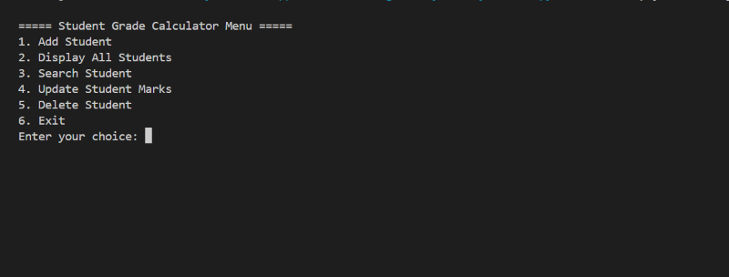
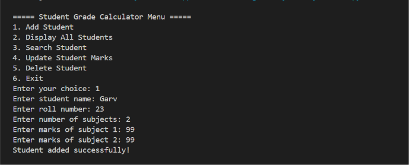
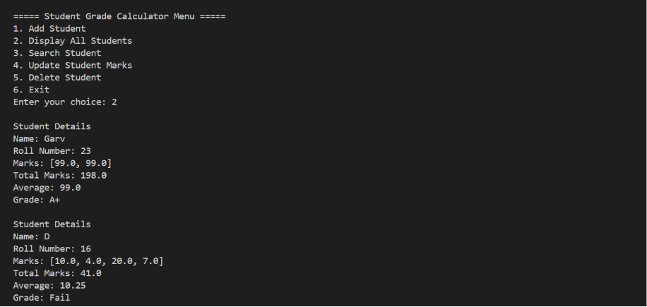
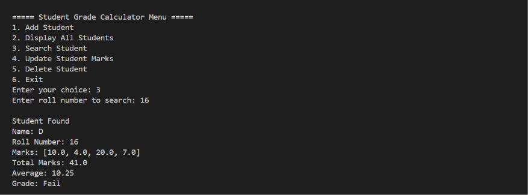

# 🎓 Student Grade Calculator

A menu-driven Python application developed to manage student records and automatically calculate grades based on students' average marks.

## 📖 Overview

This project allows users to:
- Add new student records
- Display all student records
- Search students by roll number
- Update student marks
- Delete student records
- Automatically calculate total, average, and grade

The project is built using Python and demonstrates the use of functions, loops, lists, dictionaries, and conditional statements.

---

## ✨ Features

- ➕ Add Student
- 📋 Display All Students
- 🔍 Search Student
- ✏️ Update Student Marks
- 🗑️ Delete Student
- 📊 Calculate Total Marks
- 📈 Calculate Average Marks
- 🏆 Automatic Grade Calculation
- ✅ Marks Validation (0–100)

---

## 🛠 Technologies Used

- Python 3
- Functions
- Lists
- Dictionaries
- Loops
- Conditional Statements

---

## 📊 Grade Criteria

| Average | Grade |
|---------|-------|
| 90 - 100 | A+ |
| 80 - 89 | A |
| 70 - 79 | B |
| 60 - 69 | C |
| 50 - 59 | D |
| Below 50 | Fail |

---

## ▶️ How to Run

1. Clone this repository.

2. Open the project folder.

3. Run:

```bash
python main.py
```

---

## 📸 Screenshots

### Main Menu



### Add Student



### Display Students



### Search Student




---

## 🚀 Future Improvements

- Store student records using JSON or CSV
- Add exception handling
- Prevent duplicate roll numbers
- Build a graphical user interface (GUI)
- Export student reports

---

## 👨‍💻 Author

**Aditya Siwach**

Aspiring Software Developer | Learning Python, Java, and Data Structures & Algorithms.
